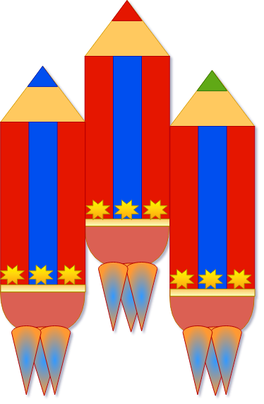
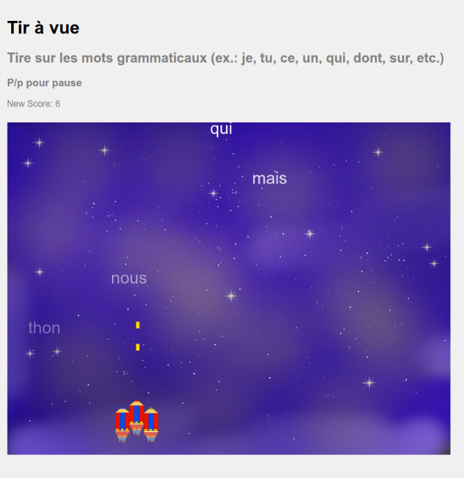
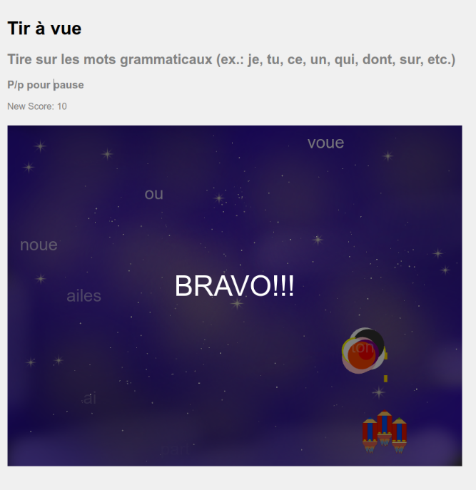

# SyntaxGames

**Experimental "serious" games to teach syntax (linguistics)**

All contents are placed under the MIT license.

## Play!

  - [Play the English version of the game](https://abalvet.github.io/SyntaxGames/en)
  - [Play the French version of the game / Jouer à la version française](https://abalvet.github.io/SyntaxGames/fr)

  

  

  

