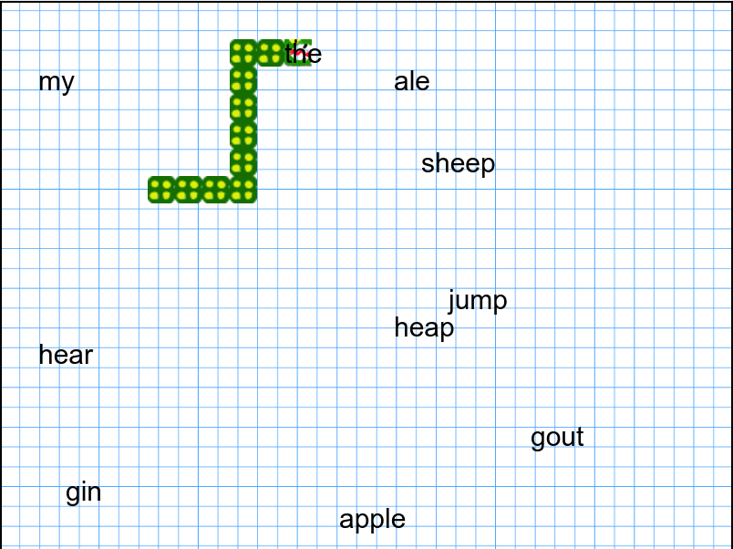

# An experimental SNAKE game to learn structural syntax

This is an experimental adaptation of the classical SNAKE game: eat all grammatical words!!! 
Don't hit the walls, and don't eat your own tail!

 - [Play the English version of the game](https://abalvet.github.io/SyntaxGames/javascript/syntax-snake/pre-alpha/en/index.html)

  

Localized versions (in French, Spanish, and Latin because why not?), and other missions  will be released soon.
