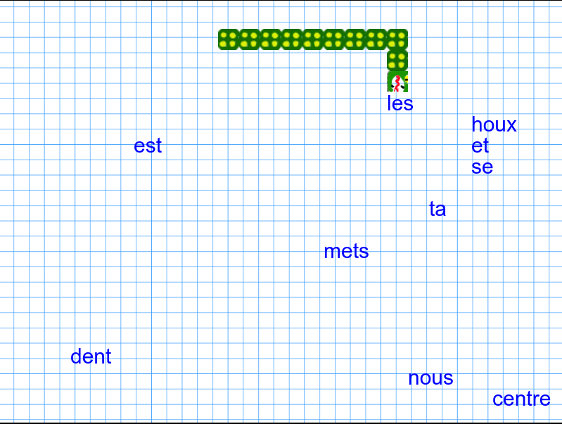

# SNAKE syntaxique: un jeu sérieux pour apprendre la syntaxe

Ceci est une adaptation du célèbre jeu SNAKE, pour apprendre à distinguer les parties du discours.
Dans cette mission, il faut avaler tous les mots grammaticaux. Le jeu est gagné lorsque le joueur atteint 10 points. 
Attention: ne te cogne pas aux murs, et ne mange pas ta propre queue :) 

 - [Jouer à la version française du jeu](https://abalvet.github.io/SyntaxGames/javascript/syntax-snake/pre-alpha/fr/index.html)

  

Des versions en d'autres langues langues (anglais, espagnol, et pourquoi pas latin?) seront bientôt disponibles, avec de nouvelles missions.

