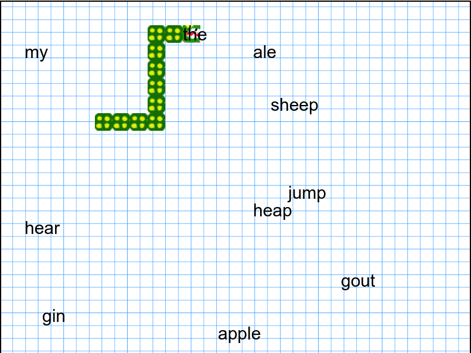

# Experimental "serious games" for learning syntax: SNAKE

In this sub-directory are the releases of an adaptation of the SNAKE iconic game.
In this version, you must eat all grammatical words (pronouns, prepositions, determiners). It's like a gamified quiz. 

# Play the game (headphones recommended)
 - [Play the English version of the game/Jouer à la version anglaise du jeu](https://abalvet.github.io/SyntaxGames/javascript/syntax-snake/pre-alpha/en/index.html)
 - [Play the French version of the game/Jouer à la version française du jeu](https://abalvet.github.io/SyntaxGames/javascript/syntax-snake/pre-alpha/fr/index.html)

  

